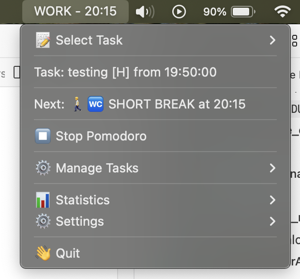
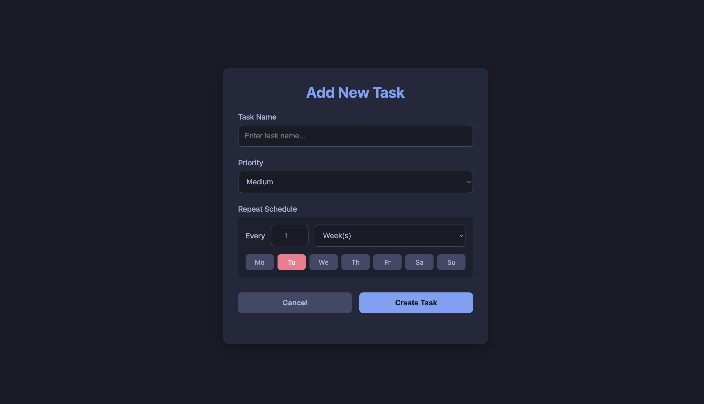
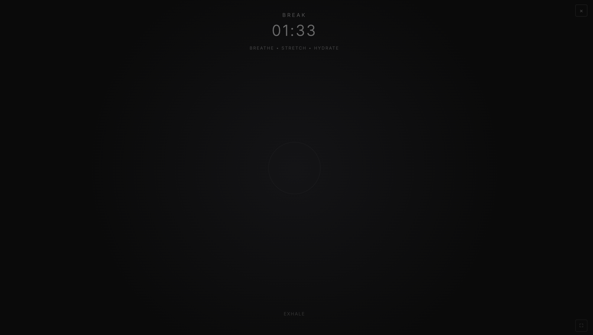

# PomodoroWork

A **macOS menu bar** Pomodoro timer with task management, session logging, web-based task editor, and analytics.

## ✨ Features

- **Menu bar timer** showing elapsed time, emoji, priority badge, and progress bar
- **Web-based task management** (add, edit, delete) with modern UI
- **Repeat scheduling** - tasks can repeat daily, weekly, monthly, or yearly with day-of-week filtering
- **Automatic task selection** before each work session
- **Session feedback** (mood, reflection, blockers) during breaks
- **Session logging** to `session_logs.json` with detailed analytics
- **Statistics menu** with daily/weekly summaries, mood analysis, and task duration breakdowns
- **Automated Fixed Schedule** - Morning (09:00-12:00) and Afternoon (13:00-18:00) sessions with predefined work/break cycles.
- **Urgent Task Indicator (⚡)** - Automatically identifies and flags tasks with less than 20 minutes of focus time during afternoon periods (`session_number >= 7`, starting from 16:10).
- **End-of-day page** - at 18:00 opens `go_home.html` with animated UI and real-time daily stats injection.
- **Zen Mode** - fullscreen break interface (`break.html`) with calming animations and stress-relief links.
- **Off-Hours Mode** - Dynamic schedule generation for manual work sessions outside 9-5.
- **Smart Sleep Detection** - Automatically saves session and pauses timer when computer sleeps or locks.
- **Auto-Refreshing Menu** - Menu items and durations update in real-time without needing an app restart.
- **Runs as LaunchAgent** - starts automatically on login.

## 📸 Screenshots

### Menu Bar Interface

*The menu bar timer showing active work session with task name and progress*

### Add Task Interface

*Web-based task creation with repeat scheduling and day selection*

### Zen Mode (Break Interface)

*Fullscreen break interface with calming animations*

## 📦 Installation

### 1. Prerequisite
Ensure you have Python 3.9+ installed on your macOS.

### 2. Clone the Repository
```bash
git clone https://github.com/gaweki/pomodoro_menubar.git pomodoro_work
cd pomodoro_work
```

### 3. Install Dependencies
```bash
# Create virtual environment (recommended)
python3 -m venv venv
source venv/bin/activate

# Install required packages
pip install -r requirements.txt
```

### 4. Run the Application
```bash
# Make executable
chmod +x main.py

# Run
./main.py
```
The timer icon (🍅) should appear in your menu bar.

### Quick Start (Automation)
Alternatively, you can use the included `manual.sh` script which handles virtual environment creation and dependency installation automatically:
```bash
chmod +x manual.sh
./manual.sh
```

### 5. Set Up LaunchAgent (Auto-start on Login)

**Option A: Using the provided plist file**
```bash
# Copy the plist to LaunchAgents directory
cp com.pomodoro.menubar.plist ~/Library/LaunchAgents/

# Edit the plist to update paths
nano ~/Library/LaunchAgents/com.pomodoro.menubar.plist

# Load the agent
launchctl load ~/Library/LaunchAgents/com.pomodoro.menubar.plist
```

**Option B: Manual plist creation**

Create `~/Library/LaunchAgents/com.pomodoro.menubar.plist`:
```xml
<?xml version="1.0" encoding="UTF-8"?>
<!DOCTYPE plist PUBLIC "-//Apple//DTD PLIST 1.0//EN" "http://www.apple.com/DTDs/PropertyList-1.0.dtd">
<plist version="1.0">
<dict>
    <key>Label</key>
    <string>com.pomodoro.menubar</string>
    <key>ProgramArguments</key>
    <array>
        <string>/usr/local/bin/python3</string>
        <string>/your_path/pomodoro_work/main.py</string>
    </array>
    <key>RunAtLoad</key>
    <true/>
    <key>KeepAlive</key>
    <true/>
    <key>StandardErrorPath</key>
    <string>/tmp/main.err</string>
</dict>
</plist>
```

Then load it:
```bash
launchctl load ~/Library/LaunchAgents/com.pomodoro.menubar.plist
```

### Managing the LaunchAgent
```bash
# Stop the agent
launchctl unload ~/Library/LaunchAgents/com.pomodoro.menubar.plist

# Restart the agent
launchctl unload ~/Library/LaunchAgents/com.pomodoro.menubar.plist&&launchctl load ~/Library/LaunchAgents/com.pomodoro.menubar.plist

# Check if running
launchctl list | grep pomodoro
```

## � Fixed Schedule (Mon-Fri)

The application follows a structured workday. It automatically switches activities based on the time:

| Period | Time | Session Numbers | Activity Pattern |
| :--- | :--- | :--- | :--- |
| **Morning** | 09:00 - 12:00 | 1 - 6 | 25m Work / 5m Break (Long break after session 4) |
| **Lunch** | 12:00 - 13:00 | - | 60m Break |
| **Afternoon** | 13:00 - 16:10 | 1 - 6 | 25m Work / 5m Break (Long break after session 4) |
| **Urgent Mode** | 16:10 - 18:00 | **7 - 10** | ⚡ Flags tasks with < 20m total work today |

*   **Session 7+ (16:10 onwards):** The "Urgent" (⚡) logic activates. It helps ensure you hit the minimum 20-minute daily goal for all available tasks before the workday ends.
*   **Off-Hours:** Outside these times (or on weekends), the app defaults to **Manual Mode**.

> **💡 Customizing the Schedule:** You can modify the `SCHEDULE` list at the beginning of `main.py` to match your own work hours and break preferences. Simply update the `start` and `end` times for each session.

## 🛠️ Configuration

## ▶️ Usage

### Adding Tasks
1. Click menu bar icon → **⚙️ Manage Tasks** → **Add New Task**
2. Browser opens with a web form
3. Enter task name, priority, and optional repeat schedule
4. Click **Create Task**
*Tip: You can also use **Quick Add (Paste)** to add a task from clipboard text.*

### Editing Tasks
1. Click menu bar icon → **⚙️ Manage Tasks** → **Edit Task** → select priority group → select task
2. Browser opens with pre-filled form
3. Modify details and click **Save Changes**

### Working on Tasks
1. Click menu bar icon → **📝 Select Task** → select priority group → choose a task
2. Work session starts automatically based on schedule
3. Menu bar displays task name, priority, and elapsed time.
4. **Urgent Indicator (⚡):** If `session_number` is 7 or higher (after 16:10) and a task has less than 20 minutes logged today, a ⚡ icon appears in the menu bar and task list.
5. Task list shows total time spent today (e.g. `(38m 27s)`), updating in real-time.
*Note: If your Mac goes to sleep or locks, the current session is saved immediately and the timer resets.*

### Off-Hours / Manual Mode
1. Outside of 09:00-18:00 (or on weekends), click **▶️ Start Pomodoro**
2. A dynamic schedule (Work 25m / Break 5m) is generated starting from *now*
3. Continues until you click **⏹️ Stop Pomodoro** or the cycle completes (4 sessions + long break)

### Breaks
1. Break starts automatically after work session
2. Zen Mode (`break.html`) opens in browser
3. After 60 seconds, feedback dialog appears (mood, reflection, blockers)
4. You can skip or fill in the feedback

### Marking Tasks Complete
1. Click menu bar icon → **⚙️ Manage Tasks** → **Mark Complete for Today** → select task
2. Task is marked as completed for the day
3. For repeating tasks, it will reappear based on schedule

### Viewing Statistics
- **📊 Statistics** → **Summary** → Daily/Weekly summaries
- **📊 Statistics** → **Task Duration Stats** → Daily/Weekly/Monthly breakdowns
- **📊 Statistics** → **Mood Analysis** → Mood trends and patterns

## 📂 Project Structure

```
pomodoro_work/
├── main.py                       # Main application
├── add.html                      # Add task web interface
├── edit_task.html                # Edit task web interface
├── break.html                    # Zen Mode break interface
├── go_home.html                  # End-of-day page
├── tasks.json                    # Task storage (auto-generated)
├── session_logs.json             # Session logs (auto-generated)
├── com.pomodoro.menubar.plist  # LaunchAgent config
├── requirements.txt              # Python dependencies
└── README.md                     # This file
```

## 🧹 Cleanup

```bash
# Remove generated files
rm -f session_logs.json tasks.json

# Remove LaunchAgent
launchctl unload ~/Library/LaunchAgents/com.pomodoro.menubar.plist
rm ~/Library/LaunchAgents/com.pomodoro.menubar.plist
```

## 🐛 Troubleshooting

### App doesn't start
- Check logs: `tail -f ~/pomodoro_menubar_error.log` (or path defined in your `.plist`)
- Verify Python path in plist matches your system: `which python3`
- Ensure script is executable: `chmod +x main.py`

### Web interface doesn't open
- Check if port 7878 is available: `lsof -i :7878`
- Try changing the port in `main.py`

### Tasks not appearing
- Check `tasks.json` for valid JSON syntax
- Verify task has correct `allowed_days` and `repeat_unit` settings
- Check if task is marked as deleted

## 📜 License

MIT - feel free to fork and improve!
